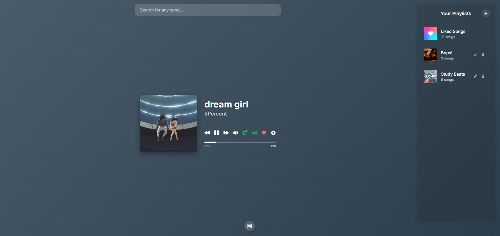

# Static Music Player
A fully static web music player, with a polished look.
No ads. No faff. Just pure music.

## Features
* **Music Source & Playback**
    * **Music Search:** Utilizes the iTunes API to search for songs.
    * **Music Video Fetching:** Fetches corresponding music videos from YouTube using the YouTube Data API v3.
        * Includes a RapidAPI fallback with key cycling for reliable video retrieval.
    * **Audio/Video Playback:** Leverages the YouTube Iframe API for seamless audio and video playback.

* **Lyrics Display**
    * Fetches and displays lyrics from **lyrics.ovh**.

* **Dynamic UI**
    * **Dynamic Background:** Changes background colors dynamically based on album art, powered by **ColorThief**.
    * **Player Controls:** Comprehensive controls for:
        * Play/Pause
        * Next/Previous track
        * Volume adjustment
        * Seekbar for track navigation
        * Loop functionality
    * **Lyrics View Toggle:** Easily switch the lyrics display on or off.

* **Playlist Management** (All data stored in `localStorage`)
    * **Liked Songs:** A dedicated playlist to save your favorite tracks.
    * **User-Created Playlists:**
        * Create new playlists.
        * Rename existing playlists.
        * Delete unwanted playlists.
    * **Song Management within Playlists:**
        * Add songs to any playlist.
        * Remove songs from user-created playlists.
        * Reorder songs within a playlist using intuitive drag-and-drop functionality.

* **Modals System**
    * Provides interactive modals for:
        * Adding songs to playlists.
        * Creating and renaming playlists.
        * General notifications and confirmations.

### Dependencies (APIs)
* - iTunes api - searching
* - lyrics.ovh - lyrics
* - youtube data v3 - player
* - RapidAPI (rapidapi.com/ytdlfree/api/youtube-v3-alternative) - cycling player