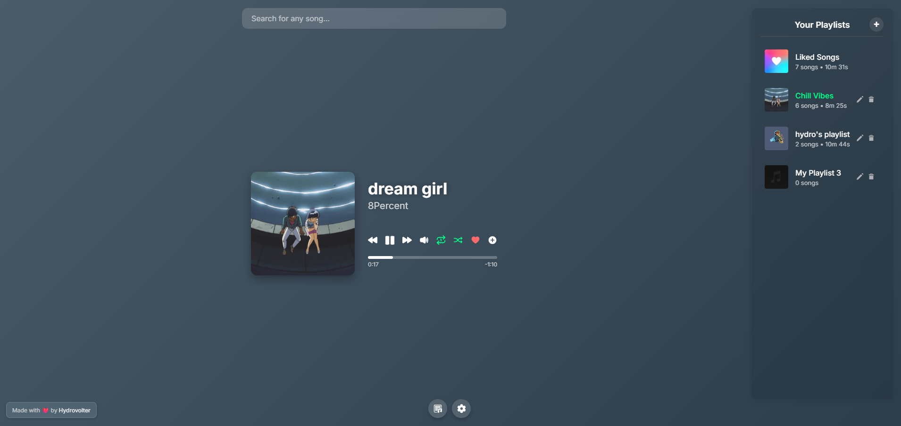

# Static Music Player
A fully static [web music player](https://hydrovolter.com/music), with a polished look.
No ads. No faff. Just pure music.

## Key Features

### 🎵 Music Discovery & Playback
*   **Song Search:** Instantly search for songs using the iTunes API, with suggestions for recent searches.
*   **Music Playback:** Stream music using embedded YouTube videos.
    *   Utilizes YouTube Data API v3 and a fallback to YouTube v3 Alternative (RapidAPI) for robust video sourcing.
    *   Intelligent API key cycling for YouTube and RapidAPI services to manage usage quotas.
*   **Lyrics Display:** View lyrics for the currently playing song, fetched from the lyrics.ovh API. Toggleable lyrics view.
*   **Standard Playback Controls:**
    *   Play/Pause
    *   Next/Previous Track (context-aware for playlists)
    *   Volume Control (Mute/Unmute)
    *   Seekbar: Visual progress with current/remaining time; click or drag to seek.
*   **Loop Modes:** Cycle through loop options: off, repeat current song, or repeat current playlist.
*   **Shuffle Play:** Shuffle playback for the currently active playlist.
*   **Error Handling:** Notifies users of playback errors (e.g., video embedding restrictions by owners).

### 🎶 Playlist Management
*   **Liked Songs:**
    *   Quickly like/unlike songs with a dedicated heart icon.
    *   Liked songs are automatically managed in a special "Liked Songs" playlist.
*   **Custom Playlists:**
    *   Create an unlimited number of personal playlists.
    *   Edit playlist names and customize playlist artwork by uploading your own images.
    *   Delete user-created playlists with confirmation.
*   **Song Management:**
    *   Add songs to any playlist (including Liked Songs) directly from search results or from the currently playing track.
    *   Remove songs individually from any playlist.
*   **Drag & Drop Functionality:**
    *   Reorder songs easily within a specific playlist.
    *   Reorder your custom playlists in the sidebar.
*   **Playlist Sidebar:**
    *   View all your playlists, including "Liked Songs," with song counts and total duration.
    *   Select a playlist to view and manage its songs.
    *   Clear visual indication of the currently playing playlist and song within the sidebar.

### 💻 User Interface & Experience
*   **Dynamic Background:** The page background dynamically changes color based on the dominant color of the current song's album art (using ColorThief.js).
*   **Album Art Display:** Prominently displays high-resolution album art for the playing song.
*   **Responsive Design:** Adapts to various screen sizes for a seamless experience on desktop and mobile devices.
*   **Interactive Modals:** Modern, glassmorphic modals for actions such as:
    *   Adding songs to playlists.
    *   Creating new playlists (with name and custom artwork).
    *   Editing existing playlists (name and artwork).
    *   Confirming actions (e.g., deletion).
    *   Accessing application settings.
*   **Toast Notifications:** Non-intrusive feedback for user actions like adding songs, creating playlists, errors, and data import/export.
*   **Recent Searches:** The search bar remembers and displays your recent search queries for quick re-access when the input is focused and empty.
*   **Visual Feedback:** Clear visual cues for active states like loop mode, shuffle mode, liked songs, and the currently playing song/playlist.
*   **Credits & Info:**
    *   Displays the latest GitHub commit information (SHA and time ago) in the settings modal for version tracking.

### 💾 Data Management & Persistence
*   **Local Storage:** All user data, including liked songs, custom playlists (with their songs and custom artwork), and recent searches, is saved directly in the browser's local storage.
*   **Data Export:** Users can export all their app data (playlists, liked songs, recent searches) as a single JSON file from the settings modal.
*   **Data Import:** Users can import data from a previously exported JSON file. This feature includes a warning as it overwrites current data. The import process includes validation of the file structure.

### ⚙️ Technical Aspects
*   **Purely Static Application:** Runs entirely in the client's browser using HTML, CSS, and JavaScript. No backend server is required.
*   **Modular JavaScript:** The codebase is organized into multiple JavaScript files for better structure, maintainability, and readability (e.g., `player.js`, `playlist.js`, `search.js`, `modals.js`).
*   **API Integration:**
    *   iTunes API: For song metadata and search.
    *   lyrics.ovh API: For fetching song lyrics.
    *   YouTube Data API v3 & YouTube v3 Alternative (RapidAPI): For sourcing video IDs for playback.
*   **API Key Management:** Implements a cycling mechanism for YouTube and RapidAPI keys to distribute usage and enhance resilience against quota limits.

## APIs Used
*   **iTunes Search API:** For searching songs and retrieving track metadata.
*   **lyrics.ovh API:** For fetching song lyrics.
*   **YouTube Data API v3 (Google):** For finding corresponding YouTube videos for playback.
*   **YouTube v3 Alternative (RapidAPI - ytdlfree):** As a fallback/alternative for YouTube video search.
*   **GitHub API:** To fetch and display latest commit information.

---

###### Made with ❤️ by [**Hydrovolter**](https://hydrovolter.com)
